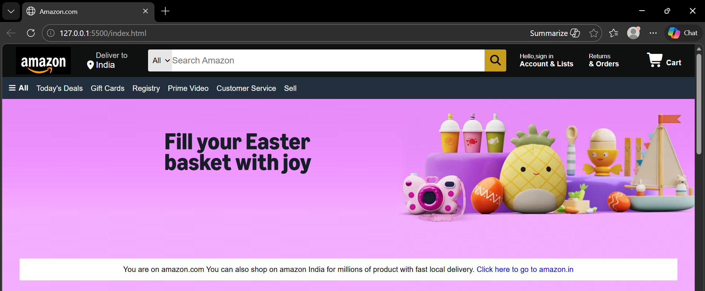
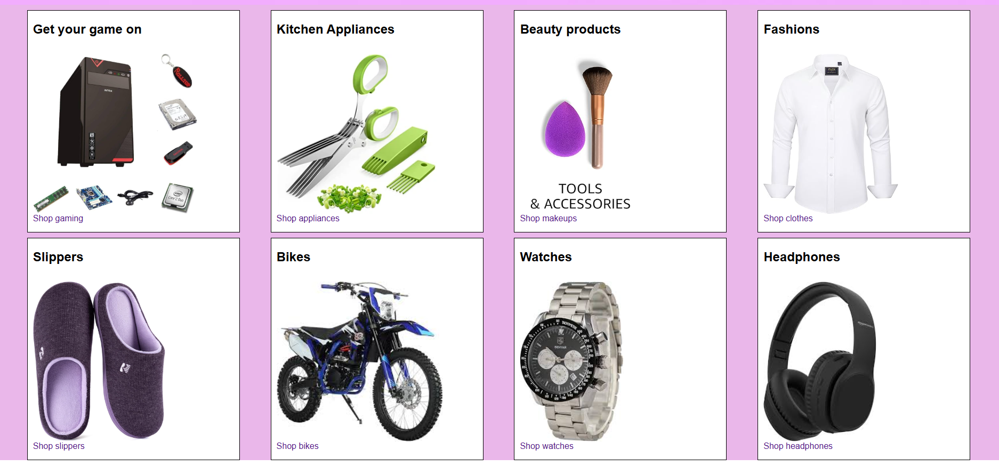
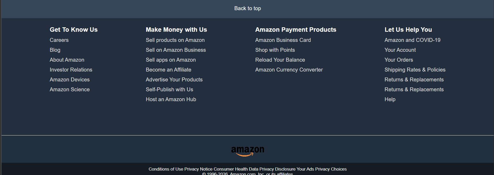

# Amazon Clone

A simple static website clone of the Amazon homepage, built using HTML and CSS. This project replicates the basic structure and styling of Amazon's landing page, including the navigation bar, hero section, product categories, and footer.

## Features

- **Responsive Navigation Bar**: Includes logo, delivery address, search bar, account options, returns, and cart.
- **Hero Section**: Displays a promotional message with a link to Amazon India.
- **Shop Section**: Showcases various product categories like gaming, kitchen appliances, beauty products, fashion, slippers, bikes, watches, and headphones, each with images and links.
- **Footer**: Contains links to various Amazon services, payment products, and help sections, along with copyright information.
- **Font Awesome Icons**: Integrated for location, search, cart, and menu icons.

## Technologies Used

- **HTML5**: For structuring the webpage.
- **CSS3**: For styling and layout.
- **Font Awesome**: For icons (loaded via CDN).

## How to Run Locally

To view this project locally on your machine:

1. **Clone the Repository**:
   ```
   git clone https://github.com/your-username/amazon-clone.git
   cd amazon-clone
   ```

2. **Open in Browser**:
   - Simply open `index.html` in your preferred web browser.

3. **Host Locally (Optional)**:
   - For a more realistic hosting experience, you can run a local server.
   - Using Python (if installed):
     ```
     python -m http.server 8000
     ```
     Then open [http://localhost:8000](http://localhost:8000) in your browser.
   - Using Node.js (install `http-server` globally first):
     ```
     npx http-server
     ```
     Then open [http://localhost:8080](http://localhost:8080) in your browser.

## How to Host on GitHub Pages

To make your Amazon clone live online:

1. **Push to GitHub**:
   - Create a new repository on GitHub (e.g., `amazon-clone`).
   - Push your code to the repository.

2. **Enable GitHub Pages**:
   - Go to your repository on GitHub.
   - Click on **Settings** > **Pages**.
   - Under **Source**, select **Deploy from a branch**.
   - Choose the `main` branch and `/ (root)` folder.
   - Click **Save**.

3. **Access Your Live Site**:
   - GitHub will provide a URL like `https://your-username.github.io/amazon-clone/`.
   - Update the **Live Demo** link in this README with your actual URL.

## Screenshots



## Live Demo

[View Live Demo](https://your-username.github.io/amazon-clone/)

*Replace `your-username` with your actual GitHub username in the link above.*

## Contributing

Feel free to fork this repository and submit pull requests for improvements.

## License

This project is for educational purposes only and is not affiliated with Amazon.com.
